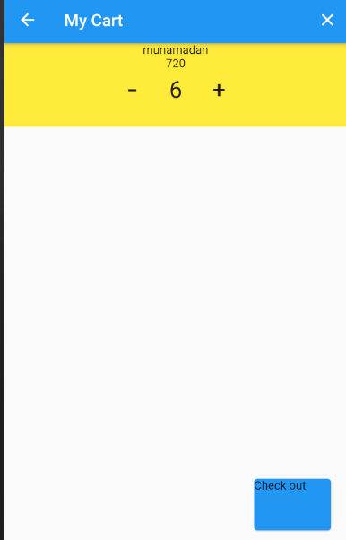

# shopping-cart-using-flutter
# This is shopping cart built without using providers,but with flutter inheritent widget.
##  I believe this example can help you to understand state management concept as well as viable use of Inheritent widget.
### Here,In this respective code,i havn't much focused on Attractive User Interface,but you can customized it as your own.
Shopping cart with basic functionality

